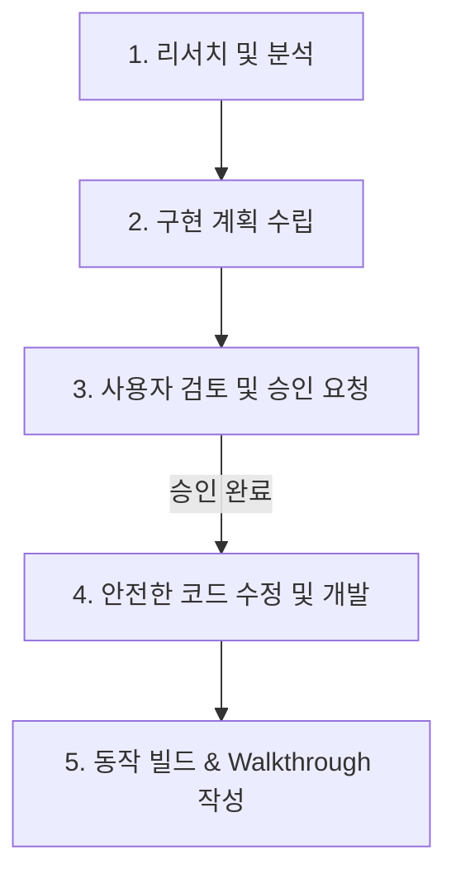

# 🤖 x-markdown-editor 개발을 위한 AI 에이전트 가이드 (AGENTS.md)

이 문서는 **x-markdown-editor** 프로젝트를 유지보수하고 기능을 확장하는 AI 에이전트(LLM)들을 위한 종합 개발 가이드라인입니다. 본 프로젝트의 아키텍처 특징, 설계 원칙, 코드 규칙 및 주의사항을 상세히 담고 있으므로, 작업을 시작하기 전에 반드시 숙지해 주시기 바랍니다.

---

## 📌 1. 프로젝트 핵심 개요

**x-markdown-editor**는 Windows 환경에 최적화된 고성능 하이브리드 마크다운(Markdown) 에디터입니다.
*   **아키텍처**: Tauri v2(Rust 백엔드) + React 19 & TypeScript(Vite 프론트엔드)
*   **핵심 철학**: 디스크의 파일 시스템을 직접 제어하며, 오프라인 및 로컬 파일 편집을 최고 우선순위로 둡니다.
*   **에디터 엔진**: Milkdown 및 Milkdown Crepe(ProseMirror 기반의 WYSIWYG 마크다운 엔진)를 탑재하고 있습니다.

---

## 📁 2. 프로젝트 디렉토리 구조 및 핵심 역할

이 프로젝트는 Tauri 구조를 따라 크게 프론트엔드(`src/`)와 백엔드(`src-tauri/`)로 분리되어 있습니다.

```text
x-markdown-editor/
├── src/                         # 🌐 React 19 & TypeScript 프론트엔드
│   ├── App.tsx                  # 메인 레이아웃, 상태 관리(Tab, Workspace, 설정 등) 및 백엔드 연동
│   ├── App.css                  # UI 전반의 스타일링 및 마크다운 편집기 테마 스타일
│   ├── MilkdownEditor.tsx       # Milkdown Crepe 엔진 래핑, 사용자 입력 제어 및 특수 파싱 규칙
│   ├── commands.ts              # Tauri backend API(invoke)를 호출하는 프론트엔드 래퍼 함수들
│   ├── markdown.ts              # 마크다운 텍스트 처리, 제목(Heading) 추출, 경로 정규화 유틸리티
│   ├── milkdownHtmlPreview.ts   # Raw HTML 블록을 안전하게 정화(DOMPurify)하고 렌더링하는 플러그인
│   └── types.ts                 # 공통 TypeScript 타입 선언
│
├── src-tauri/                   # 🦀 Rust 백엔드 (Tauri v2)
│   ├── src/
│   │   ├── main.rs              # Tauri 앱 시작 진입점
│   │   ├── lib.rs               # 백엔드 초기화 및 Tauri 커맨드 핸들러 등록
│   │   └── backend.rs           # 파일 처리, 디렉토리 탐색, 변경 감시(notify), 검색, 시스템 폰트 탐색 등
│   ├── tauri.conf.json          # Tauri 구성 파일 (보안 권한, 플러그인, 빌드 대상 설정 등)
│   └── Cargo.toml               # Rust 백엔드 의존성 설정
│
├── README.ko.md                 # 한국어 사용자 매뉴얼
└── AGENTS.md                    # 본 문서 (AI 개발 에이전트 지침서)
```

---

## 🦀 3. 백엔드 아키텍처 및 핵심 API (Rust)

백엔드(`src-tauri/src/backend.rs`)는 주로 디스크 파일 처리와 같이 시스템 권한이 필요한 네이티브 기능을 담당합니다. 모든 커맨드는 안전하게 에러를 검증하며 결과나 에러 메시지를 프론트엔드로 전달합니다.

### 🛡️ 백엔드 보안 규칙
에이전트가 백엔드 코드를 수정할 때 다음 두 가지 보안 원칙을 반드시 준수해야 합니다.
1.  **경로 이탈 방지 (`ensure_path_inside_root`)**:
    워크스페이스를 열고 마크다운을 제어할 때, 대상 파일이 워크스페이스 루트 폴더 내부(`root_path`)에 존재하는지 항상 검증해야 합니다. 외부 시스템 파일 무단 조작을 방지합니다.
2.  **마크다운 전용 검증 (`ensure_markdown_extension`, `is_markdown_path`)**:
    에디터는 오직 `.md` 및 `.markdown` 파일 확장자만 읽고 쓸 수 있어야 합니다.

### 🔌 백엔드 주요 노출 커맨드
```rust
// 예시: 파일 저장 시 에러를 검증하고 예외를 안전하게 반환하는 함수 예시 (상세 주석 포함)
#[tauri::command]
pub fn save_file(path: String, content: String) -> Result<SaveFileResponse, String> {
    let target_path = PathBuf::from(path);
    // 1. 지원하는 마크다운 확장자(.md, .markdown)를 가졌는지 확인
    ensure_markdown_extension(&target_path)?;

    // 2. 부모 폴더가 누락되어 있다면 자동으로 생성
    if let Some(parent) = target_path.parent() {
        fs::create_dir_all(parent)
            .map_err(|error| format!("폴더 생성에 실패했습니다 {}: {error}", parent.display()))?;
    }

    // 3. 파일 내용을 안전하게 쓰기
    fs::write(&target_path, content)
        .map_err(|error| format!("파일 저장에 실패했습니다 {}: {error}", target_path.display()))?;

    // 4. 저장 결과를 프론트엔드로 리턴
    Ok(SaveFileResponse {
        path: path_to_string(&target_path),
        modified_at: file_modified_at(&target_path)?,
    })
}
```

---

## 🌐 4. 프론트엔드 아키텍처 및 편집기 동작 원리 (React)

### ✍️ Milkdown & Crepe 통합 (`src/MilkdownEditor.tsx`)
이 에디터는 단순 텍스트 입력창이 아닙니다. **Milkdown Crepe** 라이브러리를 사용해 ProseMirror 기반의 WYSIWYG 렌더러를 구축했습니다.
*   **Obsidian 스타일 개행 유지**: `obsidianLineBreakRemarkPlugin`을 커스텀 구현하여, 마크다운 소스의 빈 줄과 줄바꿈이 파싱 중에 생략되거나 합쳐지지 않도록 보존합니다.
*   **HTML 정화**: raw HTML 블록을 안전하게 렌더링하기 위해 `DOMPurify`를 적용하여 XSS(크로스 사이트 스크립팅) 공격을 선제 차단합니다.
*   **맞춤법 검사 밑줄 제거**: 브라우저의 기본 맞춤법 붉은 밑줄이 거슬리지 않도록 편집 화면과 자식 텍스트 노드에 `MutationObserver`를 걸어 `spellcheck="false"` 어트리뷰트를 강제 주입합니다.

### 🏗️ 대규모 UI 상태 제어 (`src/App.tsx`)
`src/App.tsx`는 2800라인 이상의 대형 컴포넌트로, 프론트엔드의 거의 모든 중요 상태를 들고 있습니다.
*   **다중 탭 동기화**: `tabs` 상태 배열을 통해 열려 있는 마크다운 파일들의 텍스트, 변경 여부(`dirty`), 외부 수정 충돌 여부(`syncState`) 등을 관리합니다.
*   **드래그 앤 드롭**: 파일이나 단일 폴더를 창 위로 떨어트리면 Tauri 네이티브 웹뷰 드롭 이벤트를 캐치하여, `classify_drop_paths` 백엔드 커맨드로 파일 종류를 감별하고 단일 폴더일 경우 워크스페이스로 즉시 오픈합니다.
*   **파일 실시간 감시**: 외부 텍스트 편집기나 터미널에서 파일이 수정되거나 지워졌을 때, Tauri 백엔드의 `fs-event` 이벤트를 실시간으로 리슨하여 유저에게 충돌 경고(`conflict`)나 자동 새로고침 처리를 유도합니다.

---

## 🎨 5. 스타일링 및 디자인 시스템 지침

이 프로젝트는 UI 가독성과 세련된 사용자 경험을 위해 **Vanilla CSS**를 사용하고 있으며, TailwindCSS 등 외부 유틸리티 CSS 프레임워크는 사용하지 않습니다.

### 🎨 CSS 커스텀 변수 (Theme Tokens)
테마 설정(에디터 폭, 폰트 종류, 폰트 크기, 행간, 헤더 레벨별 배경색상 등)은 모두 `App.tsx`에서 React State가 바뀔 때마다 `document.documentElement.style.setProperty`를 통해 최상위 CSS 변수(`var(--editor-...)`)로 바인딩됩니다.

에이전트가 UI 스타일을 수정할 경우, 반드시 `src/App.css` 내에서 아래 정의된 테마 토큰을 유지 혹은 확장해 주십시오.

```css
/* App.css 내에서 활용되는 핵심 에디터 변수들 */
:root {
  --editor-content-width: 1240px;      /* 에디터 내부 본문 최대 폭 */
  --editor-content-padding: 44px;      /* bounded 모드와 full 모드에 따른 좌우 여백 */
  --editor-font-size: 16px;            /* 에디터 기본 폰트 크기 */
  --editor-line-height: 1.6;           /* 에디터 가독성을 위한 줄 간격 */
  --editor-font-family: "Sitka Text";  /* 사용자 선택 커스텀 폰트 */
}
```

---

## 🚨 6. AI 에이전트를 위한 개발 약속 & 체크리스트

이 프로젝트에 기여하는 모든 AI 에이전트(LLM)는 반드시 아래의 규칙들을 **절대적으로 준수**해야 합니다.

### 1️⃣ 한국어(Korean)로 모든 의사소통 및 주석 작성
*   사용자에게 전달하는 답변, 에러 로그, 개발 진행 상황 요약은 **반드시 한국어**로 작성해야 합니다.
*   수정하거나 추가하는 코드(Typescript, Rust 등) 내의 모든 설명 주석은 **친절하고 상세한 한국어**로 기재되어야 합니다.

### 2️⃣ 기존 문서 및 주석 보존 (Integrity)
*   프로젝트에 기여하면서 임의로 기존 코드의 문서나 기존 기능에 달려 있던 유익한 주석을 삭제하면 안 됩니다.
*   새로운 아키텍처나 모듈을 도입할 때만 문서 갱신을 허용합니다.

### 3️⃣ Vanilla CSS 컨벤션 준수
*   절대 임의로 TailwindCSS 또는 기타 UI 라이브러리를 무단으로 설치하거나 적용하지 마십시오.
*   세련된 화면 설계를 위해 필요한 모든 CSS 변수 조작은 `src/App.css`와 `App.tsx` 내의 CSS Variables 관리부를 따르십시오.

### 4️⃣ 에러 방지를 위한 철저한 사전 검증
*   Tauri 네이티브 기능 추가 시 `src-tauri/src/backend.rs` 내에서 `fs`, `io` 에러가 적절하게 `Result<T, String>` 형태로 포매팅되어 반환되는지 확인하십시오.
*   프론트엔드에서는 `.catch(asErrorMessage)` 등을 이용하여 유저에게 세련된 다이얼로그나 Status Bar 메시지로 상세히 에러 상황을 인지시킬 수 있어야 합니다.

### 5️⃣ 개발 및 검증 명령어 활용
*   **의존성 설치**: `npm install`
*   **개발용 앱 실행**: `npm run tauri dev`
*   **단독 프론트엔드 테스트 서버**: `npm run dev`
*   **Rust 테스트 스위트 실행**: `cd src-tauri; cargo test`
*   **Windows 최종 패키징 패키지 빌드**: `npm run package:windows` 또는 `build-windows.bat`

---

## 🛠️ 7. 에이전트 작업 프로세스 안내 (Planning & Execution)

에이전트가 새로운 피처 추가나 대규모 버그 수정을 요청받았을 경우, 다음 5단계의 구조화된 기여 방식을 따릅니다.



1.  **연구 및 탐색(Research)**: `grep_search` 등을 활용해 수정이 발생할 로직의 의존성을 세밀히 파악합니다.
2.  **계획 수립(Implementation Plan)**: `implementation_plan.md` 파일을 작성/업데이트하여 구현 목표를 명문화합니다.
3.  **검토 요청(Review Request)**: `ArtifactMetadata`의 `RequestFeedback`을 활성화하여 사용자로부터 계획서의 유효성을 승인받습니다. (승인 전까지는 코드 변경 명령을 자제합니다.)
4.  **개발 실행(Execution)**: 계획대로 코드를 수정하며 `task.md`를 갱신해 개발 진행도를 트래킹합니다. 이때 모든 주석은 상세하게 한국어로 작성합니다.
5.  **검증 및 보고(Verification & Walkthrough)**: 빌드 오류가 없고 로직이 올바르게 동작하는지 확인한 후 `walkthrough.md`에 결과를 이미지/텍스트로 기술하여 사용자에게 최종적으로 보고합니다.

---

> [!NOTE]
> 이 프로젝트는 Windows 시스템 특유의 폰트 레지스트리 경로와 네이티브 파일 이벤트를 섬세하게 핸들링하고 있습니다.
> 윈도우 네이티브 영역에 영향을 줄 수 있는 패치를 진행할 때는 반드시 OS 호환성과 권한 오류에 주의하십시오.
